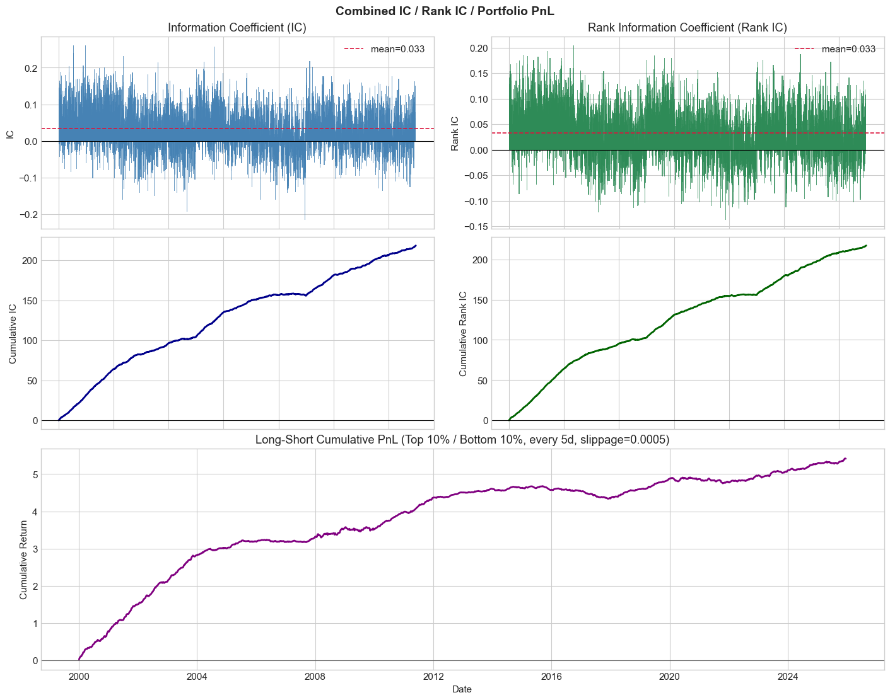

[](https://doi.org/10.5281/zenodo.15480922)

# MASTER — US SPX Reproduction

Independent reproduction of the AAAI 2024 paper [**MASTER: Market-Guided Stock Transformer for Stock Price Forecasting**](https://ojs.aaai.org/index.php/AAAI/article/view/27767) ([arXiv](https://arxiv.org/abs/2312.15235)), adapted to **US equities (S&P 500 universe)** with daily Alpha158 factors and walk-forward training.

Based on the authors’ public release ([Zenodo](https://doi.org/10.5281/zenodo.15480922)).

---

## Overview

MASTER is a stock transformer that:

1. Uses **market-guided gating** to re-weight stock features from macro/market signals
2. Applies **intra-stock** (temporal) and **inter-stock** (cross-sectional) attention
3. Aggregates the time dimension to produce a cross-sectional alpha score

| Item | Setting |
|------|---------|
| Universe | S&P 500 constituents (CRSP daily, WRDS export) |
| Features | Alpha158 (158) + turnover + market gate (63) |
| Label | 5-day forward return: `close[t+5]/close[t] - 1` |
| Lookback | `STEP_LEN = 8` trading days |
| Training | 10-year rolling window, refit every **2** years (**2000, 2002, …, 2024**) |
| OOS horizon | 2 years per fold (combined OOS: **2000–2025**) |
| Portfolio | Long top 10% / short bottom 10%, rebalance every **5** trading days |

End-to-end workflow lives in [`train.ipynb`](train.ipynb): data prep → walk-forward training → IC / portfolio / CAPM analysis.

---

## Key Results

Statistics below come from saved walk-forward OOS predictions (`outputs/walkforward/predictions.parquet`), evaluated in `train.ipynb` (Section 5). Portfolio backtests use per-stock slippage **`SLIPPAGE = 0.0005`**; annualization uses `252 / 5 = 50.4` periods per year.

### At a glance



One-panel summary (Section **8b** in `train.ipynb`): daily IC and Rank IC (top row), cumulative IC / Rank IC (middle row), and long–short cumulative PnL (bottom). OOS window: **2000-01-03 → 2025-12-23** (3.2M stock-day predictions).

#### Prediction quality (daily cross-sectional)

| Metric | Value |
|--------|------:|
| **Mean IC** | 0.0334 |
| **ICIR** | 0.586 |
| **Mean Rank IC** | 0.0332 |
| **Rank ICIR** | 0.673 |

#### Portfolio performance (long–short, top/bottom 10%)

| Strategy | Annual return | Sharpe | Cumulative return |
|----------|--------------:|-------:|------------------:|
| **Long–Short** | 20.87% | 2.24 | 5.41× |
| Long only | 23.30% | 3.48 | — |
| Short only | −2.44% | −0.39 | — |

#### CAPM vs SPX (5-day holding periods)

Regression: `beta = corr(port, SPX) × std(port) / std(SPX)`,  
`alpha_period = mean(port) − beta × mean(SPX)`,  
`alpha_annual = alpha_period × 50.4`.

| Strategy | Beta | Alpha (annual) |
|----------|-----:|---------------:|
| **Long–Short** | −0.005 | 20.90% |
| Long only | −0.003 | 23.33% |
| Short only | — | — |

> **Note:** Returns are **gross of transaction costs** beyond the fixed slippage model. Results depend on the CRSP panel, factor pipeline, and walk-forward OOS design.

### Per-fold OOS IC

From `outputs/walkforward/metrics_summary.csv`:

| Refit year | IC | ICIR | Rank IC | Rank ICIR |
|:----------:|---:|-----:|--------:|----------:|
| 2000 | 0.0602 | 0.447 | 0.0696 | 0.575 |
| 2002 | 0.0465 | 0.398 | 0.0528 | 0.467 |
| 2004 | 0.0474 | 0.349 | 0.0504 | 0.469 |
| 2006 | 0.0338 | 0.272 | 0.0339 | 0.305 |
| 2008 | 0.0402 | 0.263 | 0.0391 | 0.254 |
| 2010 | 0.0211 | 0.150 | 0.0256 | 0.175 |
| 2012 | 0.0165 | 0.184 | 0.0160 | 0.169 |
| 2014 | −0.0098 | −0.067 | −0.0038 | −0.026 |
| 2016 | 0.0003 | 0.002 | 0.0094 | 0.067 |
| 2018 | 0.0100 | 0.069 | 0.0051 | 0.033 |
| 2020 | 0.0206 | 0.120 | 0.0213 | 0.118 |
| 2022 | 0.0101 | 0.071 | 0.0106 | 0.069 |
| 2024 | 0.0070 | 0.049 | 0.0025 | 0.017 |

Signal strength is strongest in early folds (2000–2008) and weaker in recent years — consistent with alpha decay in US equities.

---

## Model & detailed figures

### Architecture


Market-guided gating → feature layer → temporal attention (intra-stock) → cross-sectional attention (inter-stock) → temporal pooling → return prediction.

### Individual analysis plots

| Figure | Description |
|--------|-------------|
| [IC](demo/IC.png) | Monthly IC bars + cumulative IC |
| [Rank IC](demo/RankIC.png) | Monthly Rank IC bars + cumulative Rank IC |
| [Portfolio PnL](demo/portfolioPNL.png) | Period return, distribution, cumulative PnL |
| [PnL decomposition](demo/PNL_decomp.png) | Long–short / long-only / short-only (no slippage) |
| [CAPM](demo/CAPM.png) | Long–short vs SPX 5-day return scatter |
| [Turnover](demo/Turnover.png) | Rebalance turnover with 12-period rolling mean |

Regenerate all figures (including `demo/all_in_one.png`) by running `train.ipynb` with `SKIP_TRAINING = True` and saving Section **8b** output.

---

## Quick Start

### 1. Environment

```bash
pip install -r requirements.txt
```

Requires Python 3.10+, PyTorch, pandas, pyqlib, pyarrow, matplotlib, jupyter.

### 2. Data

Place WRDS CRSP export at `data/spx_stock_data.csv` (gitignored), then either:

- Set `RUN_DATA_PREP = True` in `train.ipynb`, or
- Run scripts manually:

```bash
python scripts/download_market_data.py
python scripts/build_market_features.py
python scripts/build_master_panel.py
```

Panel output: `data/processed/master_panel_long.parquet`.

### 3. Train & analyze

Open `train.ipynb`:

| Flag | Purpose |
|------|---------|
| `SKIP_TRAINING = True` | Load saved predictions and run analysis only |
| `SKIP_TRAINING = False` | Run walk-forward training (hours on GPU) |
| `RETRAIN = True` | Delete old outputs and retrain from scratch |

Artifacts:

- `outputs/walkforward/predictions.parquet`
- `outputs/walkforward/metrics_summary.csv`
- `outputs/walkforward/models/us_{year}__0.pkl`

To rebuild predictions from saved checkpoints without retraining:

```bash
python scripts/reconstruct_oos.py
```

---

## Repository layout

```
MASTER_SPX/
├── config.py              # Hyperparameters & paths
├── master.py              # MASTER model (PyTorch)
├── base_model.py          # Training loop base class
├── train.ipynb            # Main notebook (train + analysis + plots)
├── scripts/
│   ├── build_master_panel.py
│   ├── run_walkforward.py
│   ├── reconstruct_oos.py
│   ├── eval_utils.py
│   └── ...
├── demo/                  # Exported figures (all_in_one, IC, PnL, …)
├── data/                  # Raw & processed data (mostly gitignored)
└── outputs/walkforward/   # Predictions, metrics, checkpoints
```

---

## Citation

If you use this code or follow the MASTER method, please cite the original paper:

```bibtex
@inproceedings{master2024,
  title={MASTER: Market-Guided Stock Transformer for Stock Price Forecasting},
  booktitle={AAAI},
  year={2024}
}
```

Original code: [Zenodo 10.5281/zenodo.15480922](https://doi.org/10.5281/zenodo.15480922).
